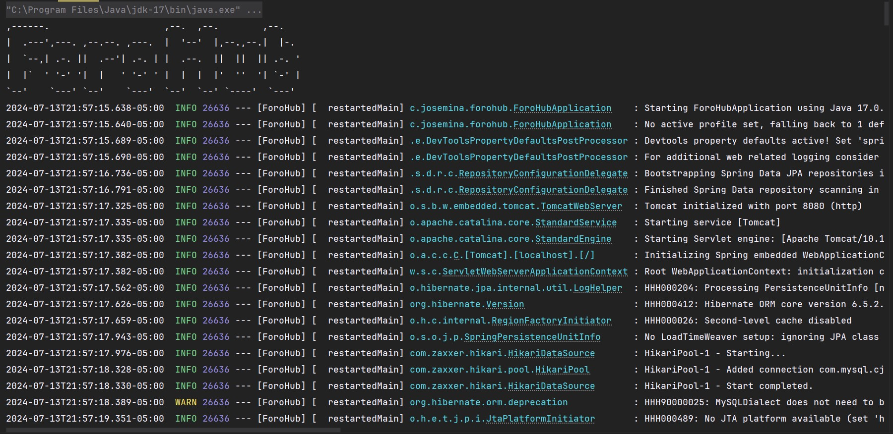
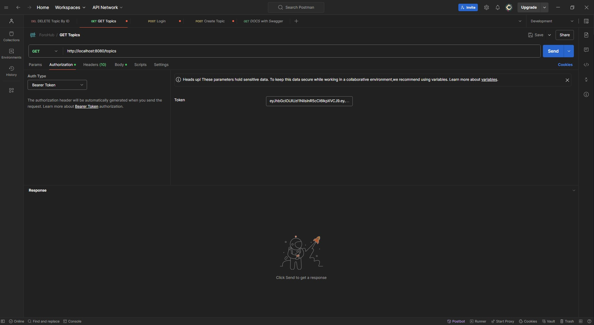
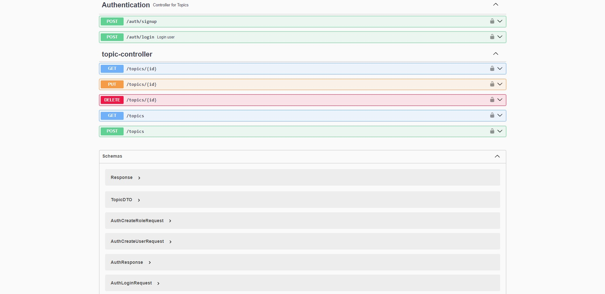
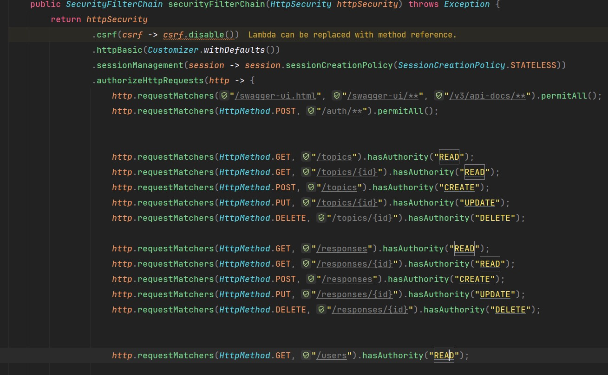

# ForoHub 


En este proyecto se desarrollo una API REST, para publicar, editar, comentar
eliminar y ver temas un foro, ademas se implementaron medidas de segurirdad
para que solo usuarios autenticados y autorizados puedan usarlo

### Características

* Crear, eliminar, actualizar, listar temas
* Crear, eliminar, actualizar, listar respuestas
* Registrar, autenticar usuarios con JWT

### Tecnologías Utilizadas

* Java
* Spring Boot
* Spring Security
* JWT
* JPA
* Postman
* Swagger
* MySql
* Lombok

### Instalación

1. Primero debes clonar el repositorio:
    >https://github.com/yersonramossullon/ForoHub.git

    Accede al directorio:
    >cd forohub

2. Crea la base de datos en MySQL
   ```sql
   CREATE DATABASE foro_hub;
   ```
3. Compilar y ejecutar la aplicación
    >mvn clean install
    > 
    >mvn spring-boot:run
    
    

### Uso

Endpoints principales:
* `/auth/login` para autenticar un usuario generando JWT
*  `/auth/signup` para crear un nuevo usuario 
* `/topics` para crear, eliminar, actulizar y obtener temas
* `/swagger-ui/index.html` para acceder a la documentación
  


* Con el archivo `ForoHub.postman_collection.json` puedes hacer pruebas con Postman

Los usuarios cuentan con Roles y permisos



### Autor
YERSON BLADIMIR RAMOS SULLON // Correo: vladimirramossullon@gmail.com


